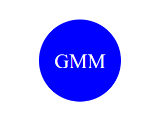

# Shapely-Logos
This application will make your simple logo dreams come true! Once you enter in your information, this application will generate a new logo for you based on your responses!

### License: MIT

## Table of Contents
- [Description](#description)
- [Live Screen Recording of Application Functionality](#live-screen-recording-of-application-functionality)
- [Screenshots](#screenshots)
- [Technologies Used](#technologies-used)
- [Installation](#installation)
- [Credits](#credits)
- [Features](#features)
- [Usage Information](#usage-information)
- [Contribution Guidelines](#contribution-guidelines)
- [Test Instructions](#test-instructions)
- [License](#license)
- [Questions](#questions)

## Description

This application enables freelance web developers to create simple logos for their clients and projects without relying on a graphic designer. It uses inquirer to prompt users within the command line for logo details, such as text content, text color, shape choice (triangle, square, or circle), and the color of the shape. Once the user answers all prompts, the application generates an SVG file representing the logo. This has made your life for logos that much easier!

### Live Screen Recording of Application Functionality
[Link to Screen Recording](https://drive.google.com/file/d/1PzrVTDdUa1pXKIKy05KZxdHyMVpudFAI/view)

### Screenshots
**###Examples of Generated Logos:**

**Screenshots of application:**

